# 🚀 AUY1105 - Evaluación Final Transversal

# Desarrollo de módulos reutilizables con Terraform y publicación en HCP Terraform Registry

> **Evaluación Final Transversal de la asignatura AUY1105 - Infraestructura como Código II**, orientada al diseño e implementación de una solución de Infraestructura como Código (IaC) utilizando Terraform.

> La solución contempla el desarrollo de módulos reutilizables para red, cómputo y almacenamiento, su versionado mediante Semantic Versioning, automatización del proceso de validación con GitHub Actions y publicación en HCP Terraform Registry para su posterior consumo desde un proyecto principal desplegado sobre Amazon Web Services (AWS).

# 📑 Contenido

- 🎯 Objetivo
- 🏛️ Arquitectura de la solución
- 🛠️ Tecnologías utilizadas
- 📂 Repositorio del proyecto
- 📁 Estructura del proyecto
- 🌐 Desarrollo del módulo Network
- 💻 Desarrollo del módulo Compute
- 💾 Desarrollo del módulo Storage
- 📦 Publicación de módulos en HCP Terraform Registry
- ⚙️ Automatización mediante GitHub Actions
- 🔒 Seguridad implementada
- 🧪 Validación y pruebas
- ☁️ Despliegue de la infraestructura
- 📊 Resultados obtenidos
- ✅ Conclusiones
- 📷 Anexos (Evidencias)

---

# 🎯 Objetivo

El objetivo de esta Evaluación Final Transversal fue diseñar e implementar una solución de **Infraestructura como Código (IaC)** utilizando **Terraform**, aplicando principios de modularidad, reutilización y automatización para el aprovisionamiento de infraestructura sobre **Amazon Web Services (AWS)**.

Para cumplir este objetivo se desarrollaron tres módulos reutilizables correspondientes a los componentes de **Network**, **Compute** y **Storage**, los cuales fueron documentados, versionados mediante **Semantic Versioning** y publicados en **HCP Terraform Registry** para su posterior consumo desde un proyecto principal.

Adicionalmente, se implementó un proceso de **Integración Continua (CI)** utilizando **GitHub Actions**, incorporando validaciones automáticas mediante **Terraform Validate**, **TFLint** y **Checkov**, con el propósito de garantizar la calidad del código, el cumplimiento de buenas prácticas y la aplicación de políticas básicas de seguridad antes del despliegue de la infraestructura.

---

---

# 🏛️ Arquitectura de la solución

La siguiente figura presenta la arquitectura general desarrollada para la Evaluación Final Transversal.

La solución implementa un flujo completo de Infraestructura como Código (IaC), iniciando con el desarrollo de los módulos reutilizables en Visual Studio Code, el control de versiones mediante Git y GitHub, la integración continua utilizando GitHub Actions y la publicación de los módulos en HCP Terraform Registry.

Posteriormente, el proyecto principal consume dichos módulos para desplegar la infraestructura en Amazon Web Services (AWS), incluyendo los componentes de red, cómputo y almacenamiento siguiendo una arquitectura modular, reutilizable y automatizada.

## Diagrama de arquitectura

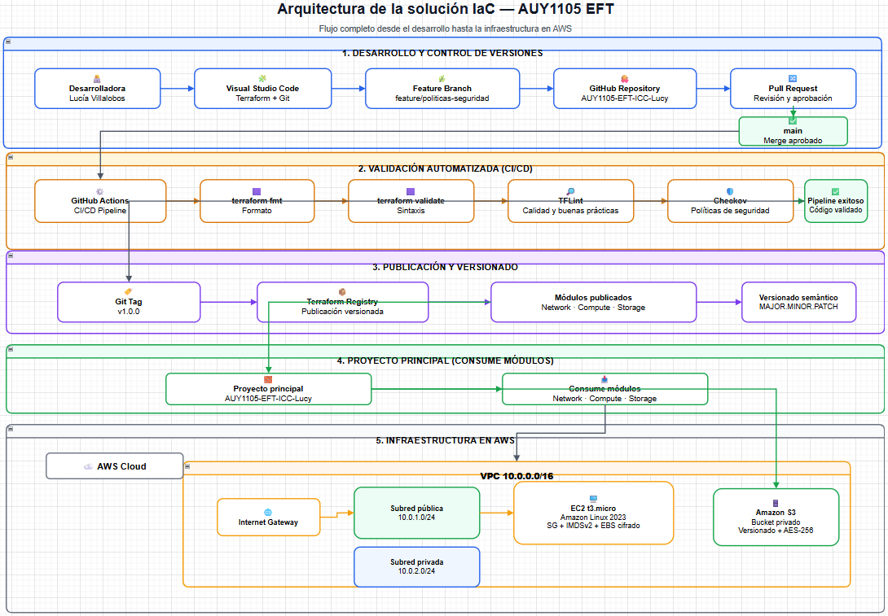

**Figura 1.** Arquitectura general de la solución desarrollada para la Evaluación Final Transversal.

### Descripción de la arquitectura

La arquitectura implementada se compone de cinco etapas principales:

1. **Desarrollo y control de versiones**, donde se implementan los módulos Terraform utilizando Visual Studio Code, Git y GitHub mediante ramas de trabajo y Pull Requests.

2. **Validación automatizada (CI/CD)**, ejecutada por GitHub Actions, incorporando las herramientas Terraform Validate, TFLint y Checkov para verificar sintaxis, buenas prácticas y políticas básicas de seguridad.

3. **Publicación y versionado**, donde los módulos son etiquetados mediante Semantic Versioning y publicados en HCP Terraform Registry para permitir su reutilización.

4. **Proyecto principal**, encargado de consumir los módulos reutilizables publicados y centralizar la configuración del despliegue.

5. **Infraestructura en AWS**, conformada por una VPC, subred pública, subred privada, Internet Gateway, una instancia EC2 y un bucket S3 configurados mediante Terraform.

---

# 🛠️ Tecnologías utilizadas

Para el desarrollo de la solución se utilizaron herramientas orientadas a la automatización de infraestructura, control de versiones, integración continua y despliegue en la nube. Cada una de ellas cumple un rol específico dentro del flujo de trabajo implementado durante la Evaluación Final Transversal.

| Tecnología | Descripción |
|------------|-------------|
| **Terraform** | Desarrollo de la infraestructura como código (IaC) mediante módulos reutilizables. |
| **Amazon Web Services (AWS)** | Plataforma Cloud utilizada para desplegar la infraestructura. |
| **Git** | Control de versiones del código fuente. |
| **GitHub** | Repositorio remoto para el almacenamiento y gestión del proyecto. |
| **GitHub Actions** | Automatización del proceso de validación e integración continua (CI/CD). |
| **HCP Terraform Registry** | Publicación y distribución de los módulos reutilizables desarrollados. |
| **Visual Studio Code** | Entorno de desarrollo utilizado para implementar y administrar el proyecto. |
| **TFLint** | Validación de buenas prácticas y calidad del código Terraform. |
| **Checkov** | Análisis estático de seguridad y cumplimiento de políticas de infraestructura. |

---

# 📂 Repositorio del proyecto

Como punto de partida se creó un repositorio público en GitHub denominado **AUY1105-EFT-ICC-Lucy**, el cual centraliza el desarrollo de la Evaluación Final Transversal.

En este repositorio se almacenó el proyecto principal, la documentación técnica, las evidencias de implementación y la configuración necesaria para consumir los módulos reutilizables publicados posteriormente en HCP Terraform Registry.

Además, el repositorio permitió gestionar el control de versiones mediante Git, implementar ramas de desarrollo, realizar Pull Requests y automatizar las validaciones utilizando GitHub Actions.

## Evidencia

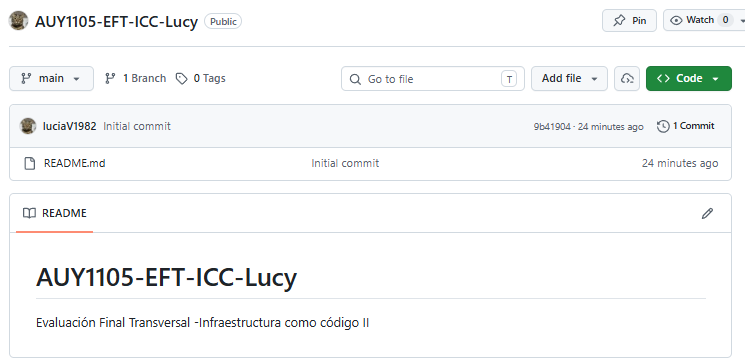

**Figura 2.** Repositorio principal utilizado para el desarrollo de la Evaluación Final Transversal.

---

# 📁 Estructura del proyecto

Con el objetivo de mantener una solución organizada, reutilizable y fácil de mantener, el proyecto fue estructurado siguiendo una arquitectura modular. Se separó el proyecto principal de los módulos Terraform, la documentación y las evidencias utilizadas durante el desarrollo.

Esta organización facilita la reutilización de componentes, mejora la mantenibilidad del código y permite una integración sencilla con HCP Terraform Registry.

## Estructura del proyecto en Visual Studio Code

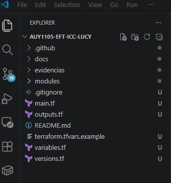

**Figura 3.** Organización del proyecto principal en Visual Studio Code.

La estructura implementada considera los siguientes elementos principales:

- **modules/**: contiene los módulos reutilizables de Network, Compute y Storage.
- **evidencias/**: almacena las capturas utilizadas para documentar el desarrollo del proyecto.
- **main.tf**: orquesta el consumo de los módulos reutilizables.
- **variables.tf**: declara las variables utilizadas por el proyecto principal.
- **outputs.tf**: expone los principales recursos desplegados.
- **terraform.tfvars.example**: proporciona un ejemplo de configuración para reutilizar el proyecto.
- **README.md**: corresponde al informe técnico de la Evaluación Final Transversal.

---

# ⚙️ Configuración del proyecto Terraform

Una vez definida la estructura del repositorio, se realizó la configuración inicial del proyecto Terraform. Esta etapa permitió establecer el proveedor de AWS, las versiones requeridas, las variables de entrada, los valores de salida y la integración de los módulos reutilizables.

El proyecto principal funciona como el punto de orquestación de la solución, debido a que centraliza la configuración y conecta los módulos **Network**, **Compute** y **Storage** mediante sus variables y outputs.

## Configuración inicial

El archivo `versions.tf` define la versión mínima requerida de Terraform y la versión compatible del proveedor de AWS. Por su parte, el bloque `provider` establece la región donde será desplegada la infraestructura y aplica etiquetas comunes a los recursos.

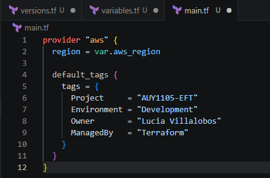

**Figura 4.** Configuración inicial de Terraform y del proveedor AWS.

## Integración de módulos

El archivo `main.tf` del proyecto principal declara los módulos que conforman la solución. Los módulos se conectan entre sí mediante variables y outputs; por ejemplo, el módulo Compute recibe el identificador de la VPC y de la subred pública generados por el módulo Network.

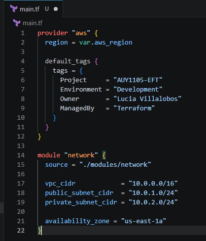

**Figura 5.** Integración inicial del módulo Network con el proyecto principal.

La configuración fue posteriormente refactorizada para evitar valores escritos directamente en el código y facilitar su reutilización en distintos entornos.

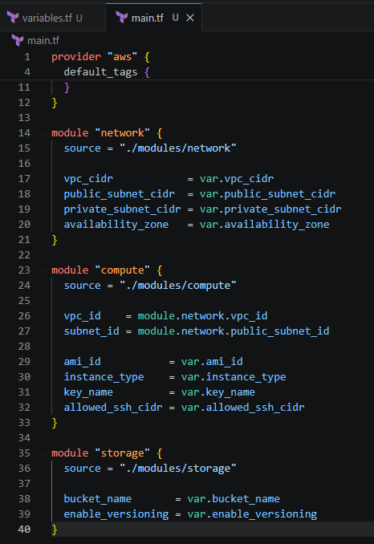

**Figura 6.** Proyecto principal refactorizado mediante variables configurables.

## Variables de configuración

Se creó el archivo `terraform.tfvars.example` como plantilla para documentar los valores necesarios para desplegar la infraestructura.

Este archivo incluye parámetros como:

- Región de AWS.
- Zona de disponibilidad.
- Rangos CIDR de la VPC y las subredes.
- Identificador de la AMI.
- Tipo de instancia.
- Nombre del Key Pair.
- Rango autorizado para SSH.
- Nombre del bucket S3.
- Activación del versionado del bucket.

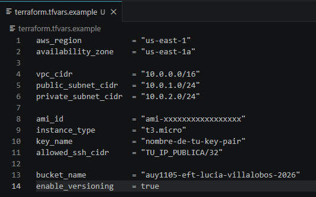

**Figura 7.** Archivo `terraform.tfvars.example` con los parámetros configurables del proyecto.

El archivo real `terraform.tfvars` no se almacena en el repositorio, ya que puede contener valores específicos del entorno de despliegue. De esta manera, el proyecto mantiene una plantilla reutilizable sin publicar configuraciones locales.

## Outputs del proyecto principal

Los outputs permiten mostrar información relevante después de ejecutar el despliegue, evitando buscar manualmente los identificadores en la consola de AWS.

Entre los valores expuestos se encuentran:

- ID de la VPC.
- ID de las subredes pública y privada.
- ID e IP pública de la instancia EC2.
- ID del Security Group.
- Nombre y ARN del bucket S3.

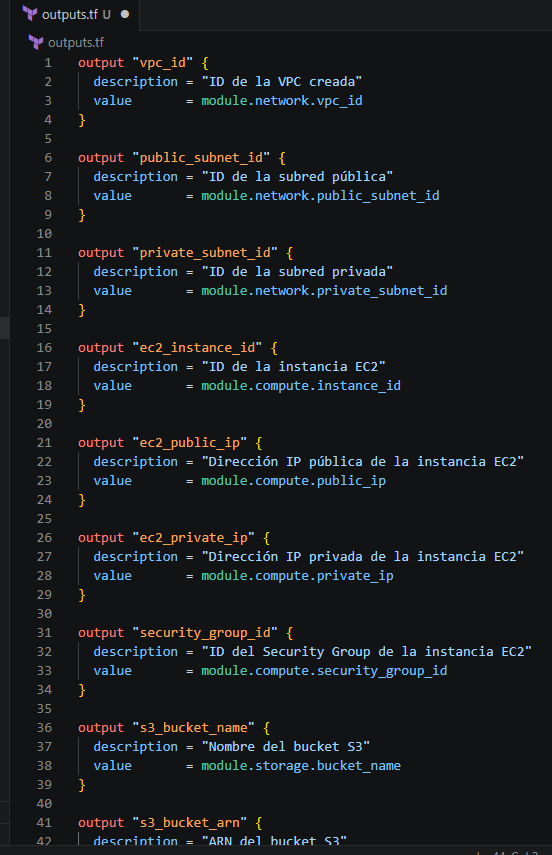

**Figura 8.** Outputs definidos para consultar los recursos desplegados.

## Protección de archivos locales

Se configuró el archivo `.gitignore` para evitar que archivos locales, temporales o sensibles sean incorporados al repositorio.

Entre los elementos excluidos se encuentran:

- Directorio `.terraform/`.
- Archivos `terraform.tfstate`.
- Archivos de respaldo del estado.
- Archivo `terraform.tfvars`.
- Planes guardados de Terraform.
- Archivos temporales generados por el entorno de desarrollo.

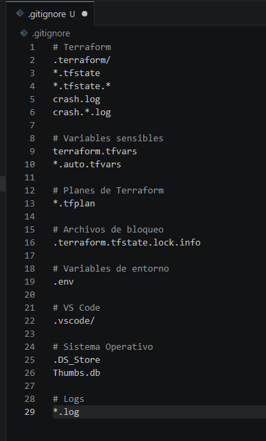

**Figura 9.** Configuración de `.gitignore` para proteger archivos locales y sensibles.

La configuración del proyecto principal permitió establecer una base modular, parametrizada y reutilizable, preparada para integrar los componentes de red, cómputo y almacenamiento.

---

# 🌐 Desarrollo del módulo Network

El primer módulo desarrollado fue **Network**, encargado de construir toda la infraestructura de red necesaria para soportar el resto de la solución.

Su implementación siguió un enfoque modular, permitiendo reutilizar el código en distintos proyectos sin necesidad de modificar la lógica interna. Este módulo fue diseñado para encapsular todos los recursos relacionados con la conectividad de la infraestructura.

Los recursos implementados por este módulo corresponden a:

- Amazon VPC.
- Subred pública.
- Subred privada.
- Internet Gateway.
- Tabla de rutas pública.
- Asociación de rutas.
- Outputs reutilizables.

---

## Definición de variables

Como primer paso se definieron las variables necesarias para parametrizar el módulo. Esto permite reutilizar la infraestructura utilizando distintos rangos CIDR, nombres y zonas de disponibilidad sin modificar el código fuente.

Las principales variables definidas corresponden a:

- CIDR de la VPC.
- CIDR de la subred pública.
- CIDR de la subred privada.
- Availability Zone.
- Nombre del proyecto.

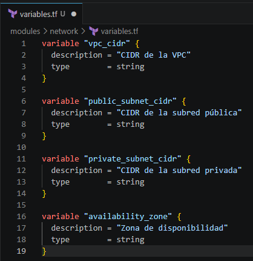

**Figura 10.** Variables configurables del módulo Network.

---

## Creación de la VPC

Posteriormente se implementó el recurso encargado de crear la Virtual Private Cloud (VPC), la cual constituye el contenedor principal donde se desplegarán todos los recursos de la solución.

La VPC fue configurada utilizando direccionamiento privado y etiquetas que permiten identificar fácilmente la infraestructura desplegada.

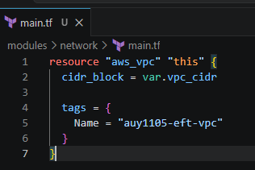

**Figura 11.** Implementación del recurso Amazon VPC.

---

## Configuración de las subredes

Dentro de la VPC se crearon dos subredes con propósitos diferentes:

- Una **subred pública**, destinada a alojar la instancia EC2 con acceso a Internet.
- Una **subred privada**, preparada para futuros recursos internos que no requieran exposición pública.

Esta separación permite mantener una arquitectura más segura y alineada con las buenas prácticas recomendadas por AWS.

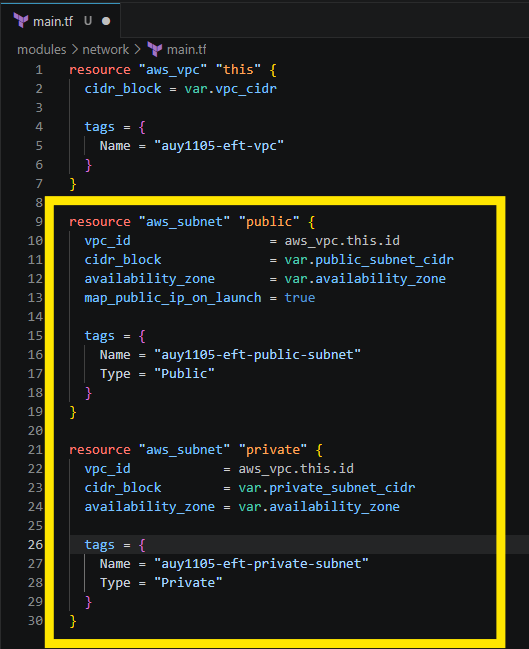

**Figura 12.** Definición de las subredes pública y privada.

---

## Configuración del Internet Gateway

Para proporcionar conectividad hacia Internet se incorporó un Internet Gateway asociado a la VPC.

Este componente permite que los recursos ubicados en la subred pública puedan establecer comunicación con redes externas.

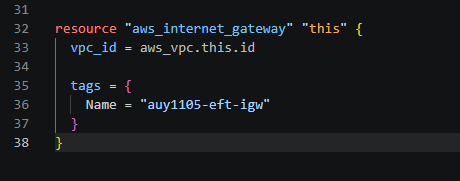

**Figura 13.** Creación del Internet Gateway.

---

## Configuración de la tabla de rutas

Se implementó una tabla de rutas pública que dirige el tráfico externo hacia el Internet Gateway.

Posteriormente, dicha tabla fue asociada a la subred pública para permitir el acceso desde y hacia Internet.

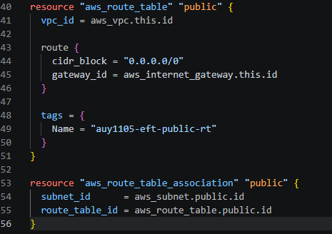

**Figura 14.** Configuración de la tabla de rutas pública.

---

## Outputs del módulo

Finalmente se declararon los outputs necesarios para exponer la información generada por el módulo y permitir su consumo desde otros módulos del proyecto.

Entre los principales outputs definidos se encuentran:

- ID de la VPC.
- ID de la subred pública.
- ID de la subred privada.
- ID del Internet Gateway.

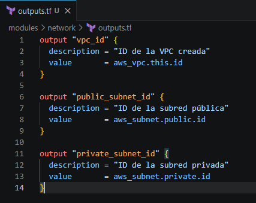

**Figura 15.** Outputs publicados por el módulo Network.

---

## Documentación del módulo

Como parte de las buenas prácticas, el módulo fue documentado mediante un archivo README independiente, describiendo su propósito, variables de entrada, outputs y ejemplo de utilización.

Esta documentación facilita la reutilización del módulo tanto en este proyecto como en futuros desarrollos.

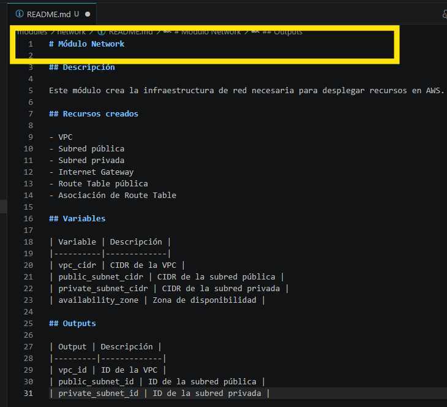

**Figura 16.** Documentación técnica del módulo Network.

El resultado obtenido fue un módulo completamente reutilizable, desacoplado del proyecto principal y preparado para ser versionado y publicado posteriormente en HCP Terraform Registry.

---

# 💻 Desarrollo del módulo Compute

Una vez implementada la infraestructura de red, se desarrolló el módulo **Compute**, responsable de aprovisionar la instancia Amazon EC2 y configurar las reglas básicas de acceso mediante un Security Group.

Este módulo fue diseñado para consumir los recursos generados por el módulo **Network**, utilizando el identificador de la VPC y la subred pública como parámetros de entrada. De esta manera se mantiene el desacoplamiento entre módulos y se favorece la reutilización del código.

Los principales recursos implementados corresponden a:

- Security Group.
- Instancia Amazon EC2.
- Variables de configuración.
- Outputs reutilizables.

---

## Definición de variables

El módulo incorpora variables que permiten parametrizar la creación de la instancia EC2, evitando mantener valores escritos directamente en el código.

Entre las principales variables definidas se encuentran:

- ID de la VPC.
- ID de la subred pública.
- AMI de Amazon Linux 2023.
- Tipo de instancia.
- Nombre del Key Pair.
- Rango permitido para conexiones SSH.

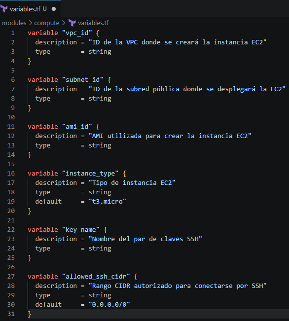

**Figura 17.** Variables configurables del módulo Compute.

---

## Configuración del Security Group

Como medida básica de seguridad se implementó un Security Group encargado de controlar el tráfico permitido hacia la instancia EC2.

Durante la configuración se habilitó el acceso SSH únicamente desde la dirección IP autorizada definida mediante la variable `allowed_ssh_cidr`, reduciendo la superficie de exposición del servidor.

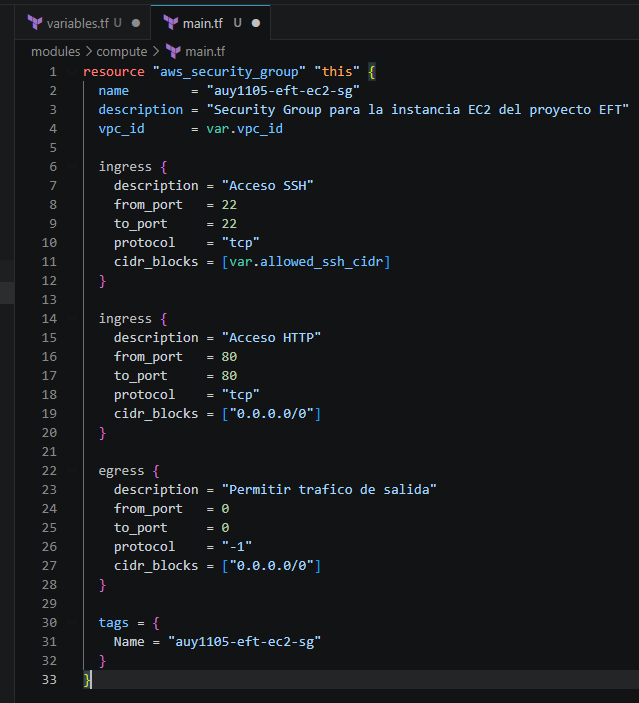

**Figura 18.** Configuración del Security Group de la instancia EC2.

---

## Creación de la instancia EC2

Posteriormente se implementó el recurso encargado de crear la instancia Amazon EC2 utilizando Amazon Linux 2023.

La instancia fue desplegada dentro de la subred pública creada previamente por el módulo Network y asociada automáticamente al Security Group configurado durante la etapa anterior.

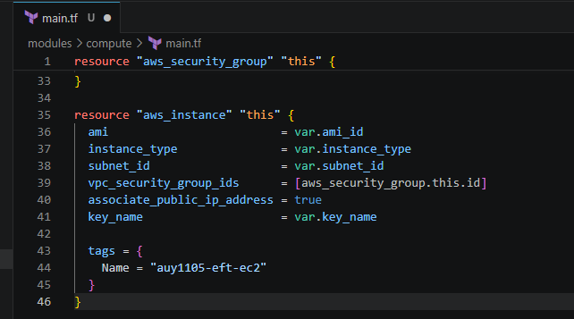

**Figura 19.** Implementación de la instancia Amazon EC2.

---

## Outputs del módulo

Con el objetivo de facilitar la integración con el proyecto principal, el módulo publica distintos outputs que permiten acceder a la información generada durante el despliegue.

Entre ellos destacan:

- ID de la instancia.
- Dirección IP pública.
- Dirección IP privada.
- ID del Security Group.

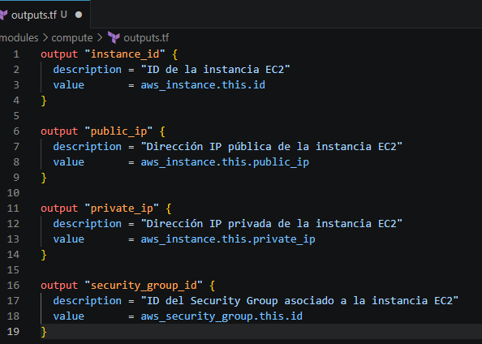

**Figura 20.** Outputs publicados por el módulo Compute.

---

## Integración con el proyecto principal

Una vez finalizado el módulo, este fue integrado al archivo `main.tf` del proyecto principal mediante el bloque `module`.

La configuración permite reutilizar el módulo simplemente proporcionando las variables de entrada necesarias, manteniendo una arquitectura completamente modular.

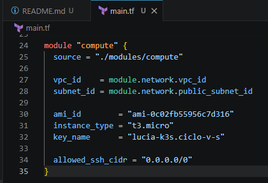

**Figura 21.** Integración del módulo Compute con el proyecto principal.

---

## Validación del módulo

Después de integrar el módulo Compute se ejecutaron nuevamente `terraform init` y `terraform validate`, confirmando que la configuración fuera válida y que las dependencias se encontraran correctamente inicializadas.

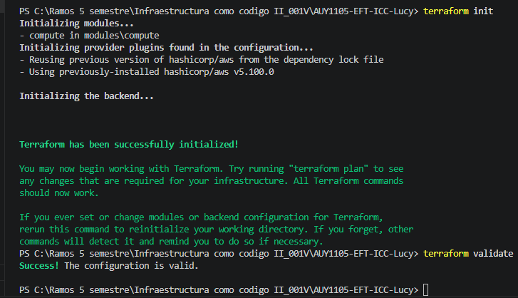

**Figura 22.** Reinicialización y validación exitosa del módulo Compute.

---

## Documentación del módulo

Al igual que el resto de los módulos desarrollados para esta evaluación, el módulo **Compute** fue documentado mediante un archivo README independiente.

La documentación describe el propósito del módulo, los recursos creados, las variables de entrada, los outputs disponibles y un ejemplo de utilización, facilitando su reutilización en futuros proyectos.

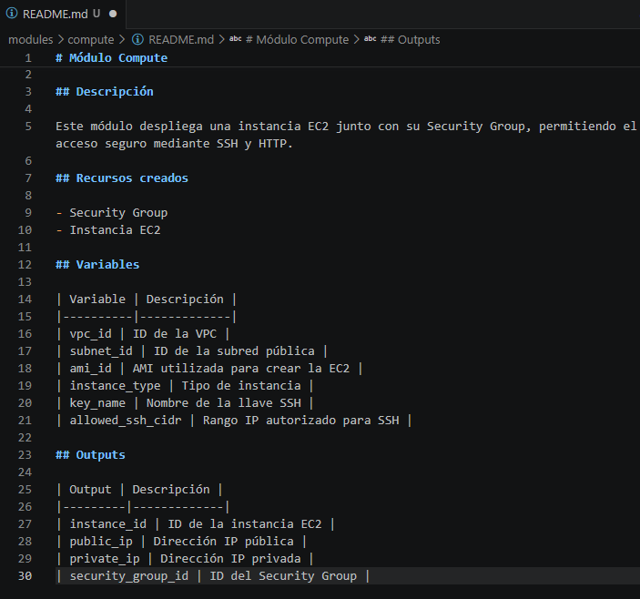

**Figura 24.** Documentación técnica del módulo Compute.

Con la implementación de este módulo se logró desacoplar completamente la infraestructura de cómputo del proyecto principal, permitiendo desplegar instancias EC2 de manera reutilizable y consistente mediante Terraform.

---

# 💾 Desarrollo del módulo Storage

El tercer módulo desarrollado corresponde a **Storage**, cuya finalidad es implementar un bucket Amazon S3 para el almacenamiento seguro de información.

Este módulo fue diseñado siguiendo las buenas prácticas recomendadas por AWS, incorporando configuraciones de seguridad como el bloqueo del acceso público, el versionado de objetos y el cifrado del lado del servidor.

Los recursos implementados por este módulo corresponden a:

- Bucket Amazon S3.
- Bloqueo de acceso público.
- Versionado del bucket.
- Cifrado del lado del servidor.
- Variables de configuración.
- Outputs reutilizables.

---

## Definición de variables

El módulo incorpora variables que permiten parametrizar el nombre del bucket y la activación del versionado, facilitando su reutilización en distintos proyectos sin modificar el código fuente.

Las principales variables definidas corresponden a:

- Nombre del bucket.
- Habilitación del versionado.

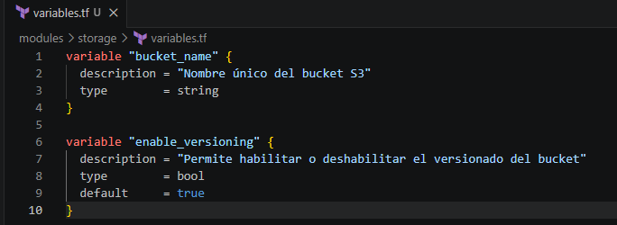

**Figura 25.** Variables configurables del módulo Storage.

---

## Creación del bucket S3

Como primer recurso del módulo se implementó el bucket Amazon S3, el cual será utilizado para almacenar información de manera centralizada.

El nombre del bucket se define mediante una variable, permitiendo cumplir con el requisito de unicidad global exigido por AWS.

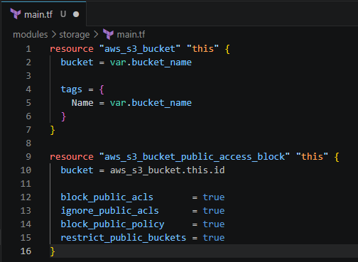

**Figura 26.** Creación del bucket Amazon S3.

---

## Configuración del versionado

Posteriormente se habilitó el versionado del bucket, permitiendo conservar el historial de modificaciones realizadas sobre los objetos almacenados.

Esta funcionalidad constituye una buena práctica para prevenir pérdidas accidentales de información y facilitar procesos de recuperación.

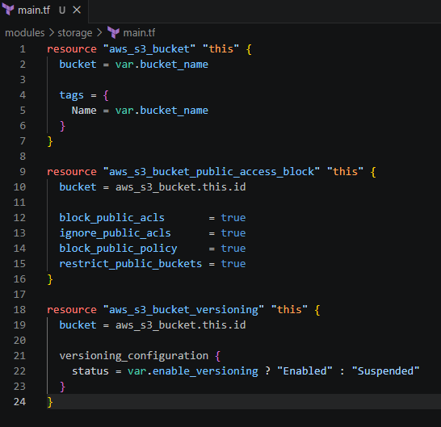

**Figura 27.** Configuración del versionado del bucket S3.

---

## Configuración del cifrado

Con el propósito de proteger la información almacenada, se configuró el cifrado automático utilizando el algoritmo AES-256 administrado por Amazon S3.

Esta configuración garantiza que todos los objetos almacenados permanezcan cifrados de manera transparente.

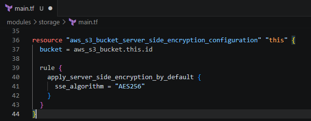

**Figura 28.** Configuración del cifrado del bucket mediante AES-256.

---

## Outputs del módulo

El módulo publica como outputs la información necesaria para ser reutilizada desde el proyecto principal.

Entre los principales valores expuestos se encuentran:

- Nombre del bucket.
- ARN del bucket.

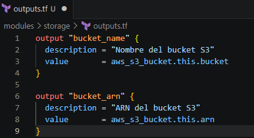

**Figura 29.** Outputs publicados por el módulo Storage.

---

## Integración con el proyecto principal

Una vez implementado el módulo, este fue incorporado al archivo `main.tf` del proyecto principal utilizando el bloque `module`, permitiendo consumir el bucket S3 mediante variables de configuración.

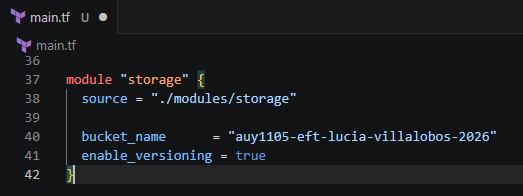

**Figura 30.** Integración del módulo Storage con el proyecto principal.

---

## Corrección durante el desarrollo

Durante la implementación se detectó un conflicto asociado a la creación duplicada de un recurso del bucket S3.

El problema fue identificado mediante Terraform y corregido antes de la validación final del proyecto, manteniendo la consistencia del estado de la infraestructura y evitando la creación de recursos duplicados.

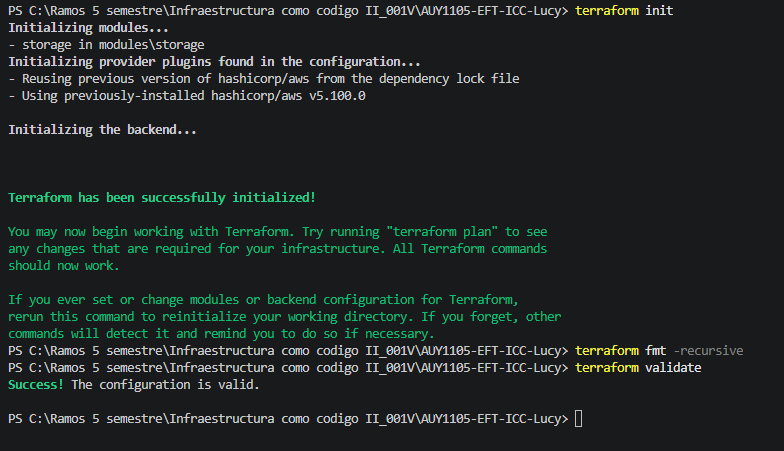

**Figura 31.** Corrección aplicada al módulo Storage durante el desarrollo.

---

## Documentación del módulo

Como parte de las buenas prácticas de desarrollo, el módulo fue documentado mediante un archivo README independiente.

La documentación describe el propósito del módulo, los recursos implementados, las variables de entrada, los outputs disponibles y un ejemplo de utilización, facilitando su reutilización desde otros proyectos Terraform.

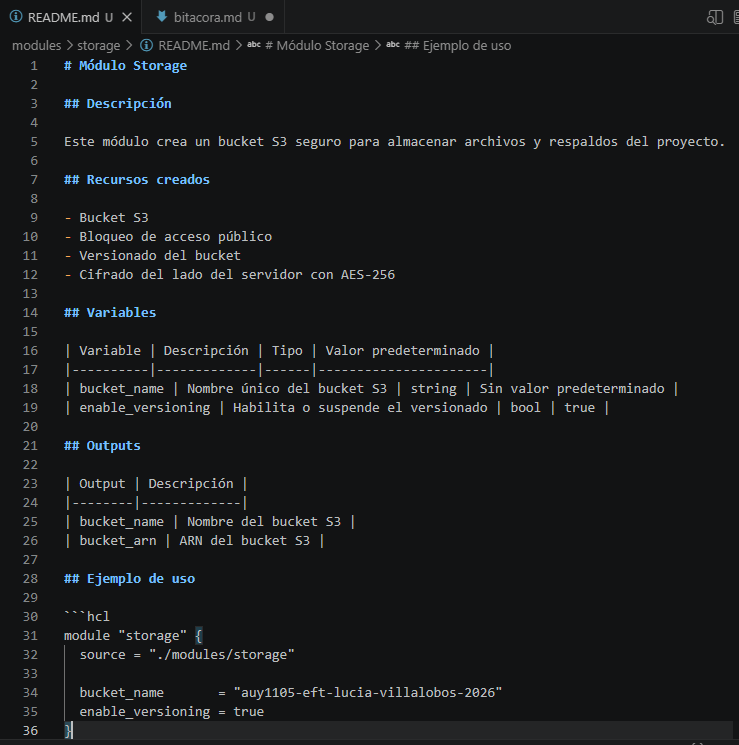

**Figura 32.** Documentación técnica del módulo Storage.

Con la implementación de este módulo se completó el desarrollo de los tres componentes reutilizables de la solución (**Network**, **Compute** y **Storage**), estableciendo una arquitectura modular preparada para ser versionada, publicada y consumida desde el proyecto principal.

---

# ⚙️ Automatización mediante GitHub Actions

Como parte de las buenas prácticas de desarrollo e integración continua, se implementó un flujo de trabajo automatizado utilizando **GitHub Actions**, con el objetivo de validar la calidad del código Terraform antes de integrar los cambios al repositorio principal.

El pipeline fue configurado para ejecutarse automáticamente sobre las ramas de desarrollo y durante el proceso de Pull Request, permitiendo detectar errores de sintaxis, incumplimiento de buenas prácticas y problemas de seguridad antes del despliegue de la infraestructura.

Las principales validaciones incorporadas fueron:

- Terraform Format (`terraform fmt`).
- Terraform Validate (`terraform validate`).
- TFLint.
- Checkov.

---

## Configuración del Workflow

El primer paso consistió en crear el archivo de workflow dentro del directorio `.github/workflows`, donde se definieron todas las etapas del proceso de validación automática.

Este workflow establece el entorno de ejecución, instala Terraform y ejecuta secuencialmente las herramientas de validación configuradas para el proyecto.

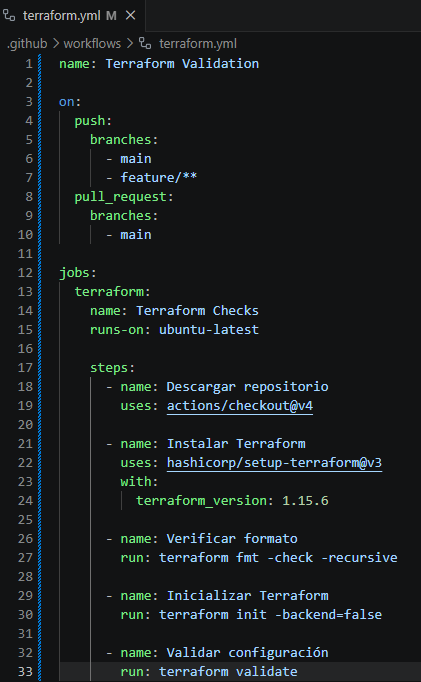

**Figura 33.** Configuración del workflow de GitHub Actions.

---

## Desarrollo mediante Feature Branch

Para mantener un flujo de trabajo ordenado se creó una rama de desarrollo (`feature`) destinada a implementar las mejoras antes de integrarlas a la rama principal.

Esta estrategia permite aislar los cambios, facilitar la revisión del código y reducir el riesgo de afectar la versión estable del proyecto.

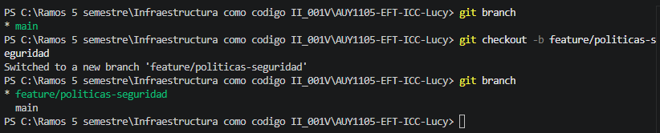

**Figura 34.** Creación de la rama de desarrollo.

---

## Creación del Pull Request

Una vez finalizado el desarrollo y verificadas las validaciones locales, los cambios fueron enviados al repositorio remoto mediante un Pull Request.

Este proceso permitió revisar las modificaciones antes de integrarlas a la rama principal.

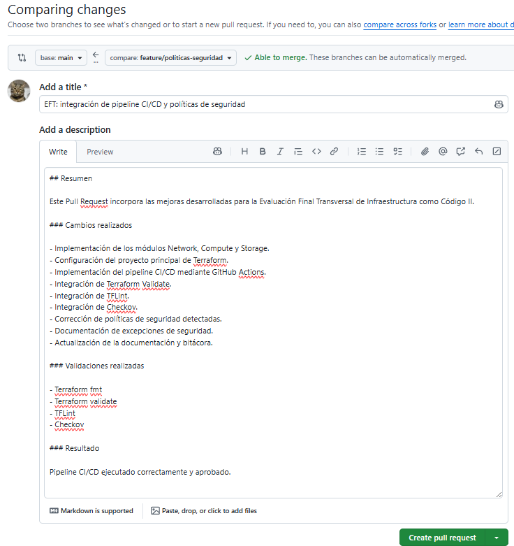

**Figura 35.** Creación del Pull Request para integrar los cambios.

---

## Ejecución automática del Pipeline

Al crear el Pull Request, GitHub Actions ejecutó automáticamente el workflow configurado, validando el proyecto Terraform antes de permitir la integración de los cambios.

El pipeline ejecutó las siguientes etapas:

- Terraform fmt.
- Terraform validate.
- TFLint.
- Checkov.

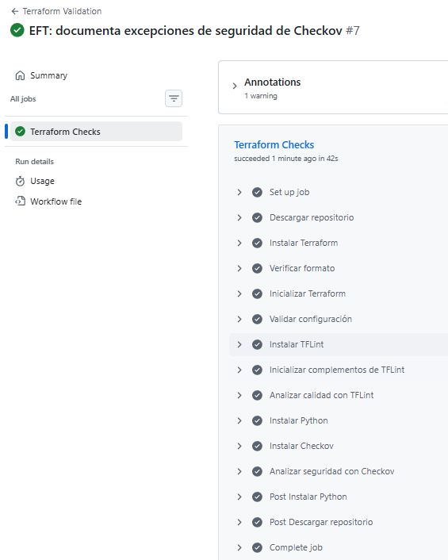

**Figura 36.** Ejecución automática del pipeline de validación.
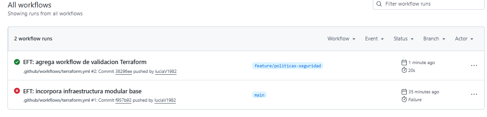
---

## Validación mediante Merge

Una vez completadas correctamente todas las validaciones, el Pull Request fue aprobado e integrado a la rama **main**.

Esta acción desencadenó nuevamente la ejecución del pipeline, garantizando que el código incorporado cumpliera con las políticas definidas para el proyecto.

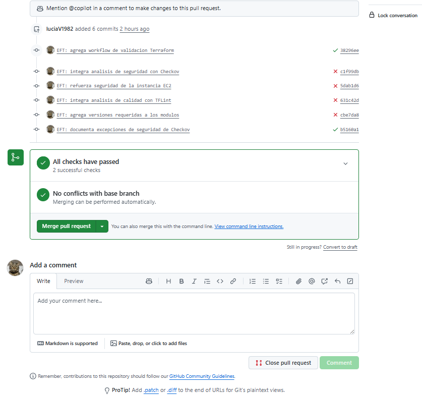

**Figura 37.** Integración del Pull Request en la rama principal.

---

## Pipeline completado correctamente

Finalmente, GitHub Actions confirmó la ejecución satisfactoria de todas las validaciones implementadas.

El resultado obtenido evidencia que la infraestructura cumple con los controles definidos para el proyecto, asegurando una base confiable antes de proceder al despliegue sobre AWS.

**Figura 38.** Ejecución exitosa del pipeline de Integración Continua.

La implementación de GitHub Actions permitió automatizar el proceso de validación del proyecto, reduciendo errores manuales y garantizando que cada modificación incorporada al repositorio principal cumpliera con los estándares de calidad, seguridad y mantenibilidad definidos para la solución.

---

# 🔒 Seguridad implementada

Con el propósito de fortalecer la infraestructura desplegada, se incorporaron medidas básicas de seguridad tanto en la configuración de la instancia EC2 como en el proceso de validación automática del código.

## Configuración de seguridad de la instancia

Durante el desarrollo del módulo Compute se habilitaron configuraciones orientadas a mejorar la seguridad de la instancia EC2, incluyendo el uso de **IMDSv2** para proteger el acceso a los metadatos y el **cifrado del volumen EBS** asociado.

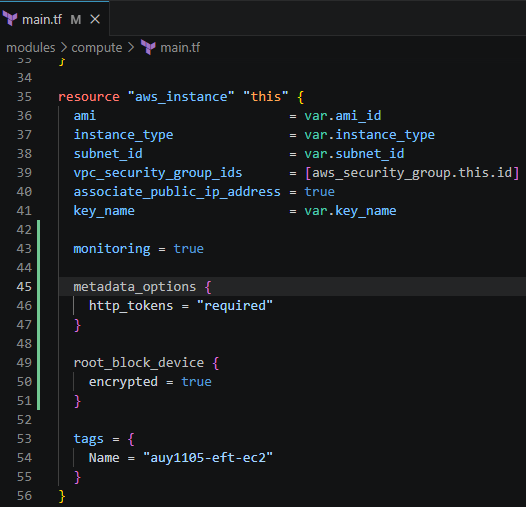

**Figura 39.** Configuración de seguridad aplicada a la instancia EC2.

---

## Validación con Checkov

Como parte del pipeline de GitHub Actions se ejecutó **Checkov**, herramienta utilizada para analizar la infraestructura como código y verificar el cumplimiento de buenas prácticas de seguridad.

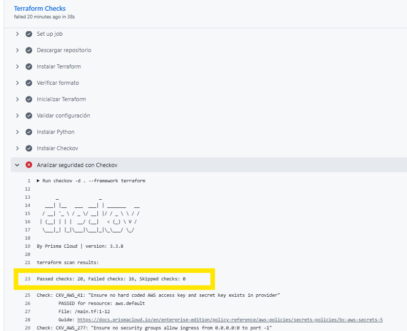

**Figura 40.** Ejecución de Checkov sobre el proyecto Terraform.

---

## Corrección de observaciones

Las observaciones detectadas durante el análisis fueron revisadas y corregidas antes de la publicación de los módulos, manteniendo una configuración más segura y alineada con las recomendaciones de Terraform y AWS.

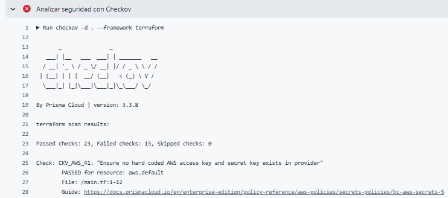

**Figura 41.** Corrección de observaciones detectadas por Checkov.

---

## Excepciones documentadas

Algunas advertencias fueron documentadas como excepciones justificadas debido al alcance de la evaluación y a las características de la infraestructura implementada.

**Figura 42.** Excepciones documentadas durante la validación de seguridad.

---

# 🧪 Validación y pruebas

Antes del despliegue de la infraestructura se realizaron distintas validaciones para comprobar que la configuración Terraform cumpliera con los requisitos funcionales y las buenas prácticas de desarrollo.

Las principales herramientas utilizadas fueron **Terraform Validate**, **Terraform Format** y **TFLint**, permitiendo detectar errores de sintaxis, formato y calidad del código.

## Validación de la configuración

Se ejecutó `terraform validate` para verificar que la configuración del proyecto fuera correcta y que todos los módulos se encontraran correctamente integrados.

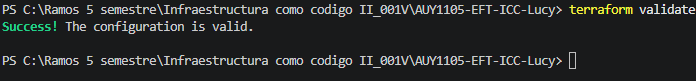

**Figura 43.** Validación exitosa de la configuración Terraform.

---

## Validación con TFLint

Finalmente se utilizó **TFLint** para revisar la calidad del código y detectar posibles configuraciones mejorables antes del despliegue.

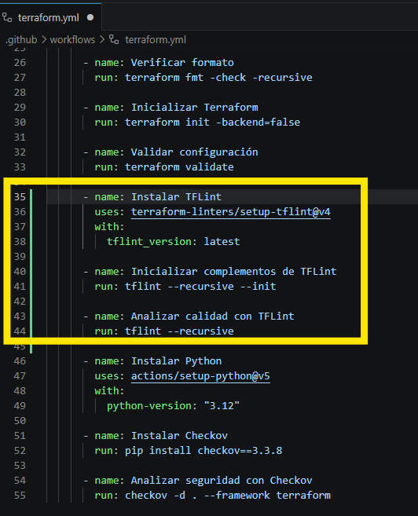

**Figura 45.** Validación del proyecto mediante TFLint.

Las validaciones realizadas confirmaron que el proyecto se encontraba en condiciones de ser desplegado sobre AWS, cumpliendo con los controles de calidad definidos para la solución.

---

# ☁️ Despliegue de la infraestructura

Una vez finalizadas las etapas de desarrollo y validación, se procedió al despliegue de la infraestructura sobre **Amazon Web Services (AWS)** utilizando Terraform.

Para ello se configuraron previamente los parámetros necesarios, incluyendo la AMI de Amazon Linux 2023, el Key Pair para acceso SSH y las variables definidas en el archivo `terraform.tfvars`.

---

## Preparación del despliegue

Como primer paso se obtuvo la AMI oficial de Amazon Linux 2023 y se verificó la existencia del Key Pair requerido para la creación de la instancia EC2.

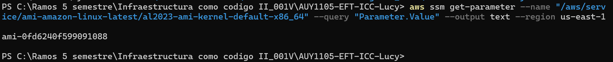

**Figura 46.** Obtención de la AMI oficial de Amazon Linux 2023.

---

## Configuración de variables

Posteriormente se completó el archivo `terraform.tfvars` con los valores específicos del entorno de despliegue.

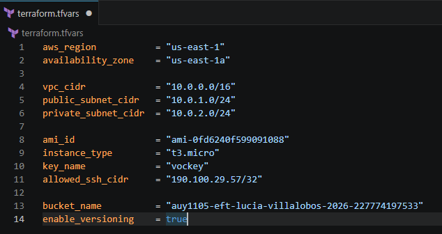

**Figura 48.** Configuración de las variables del proyecto.

---

## Planificación de la infraestructura

Antes de crear los recursos se ejecutó `terraform plan`, permitiendo revisar las acciones que Terraform realizaría sobre la infraestructura.

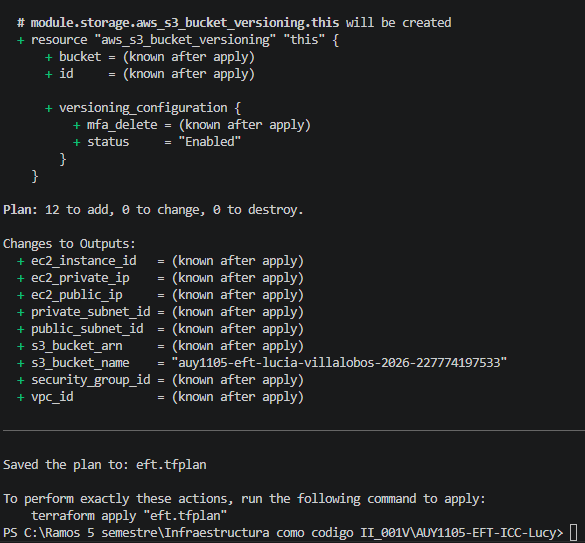

**Figura 49.** Resultado de la planificación de la infraestructura.

---

## Despliegue de los recursos

Luego se ejecutó `terraform apply`, creando automáticamente los recursos definidos en los módulos reutilizables.

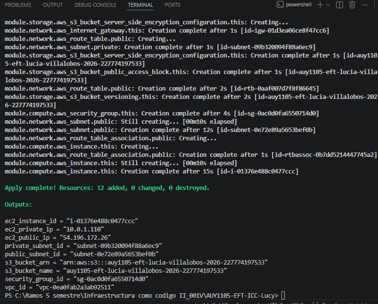

**Figura 50.** Ejecución del despliegue mediante Terraform.

---

## Infraestructura creada

Una vez finalizado el proceso se verificó la creación de los principales recursos en AWS.

- VPC.
- Subred pública.
- Subred privada.
- Internet Gateway.
- Instancia EC2.
- Bucket S3.

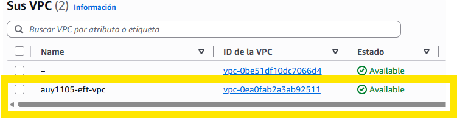

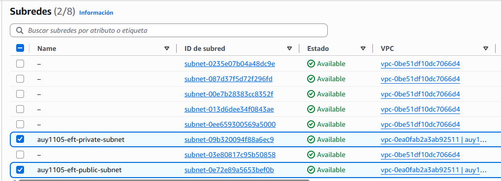

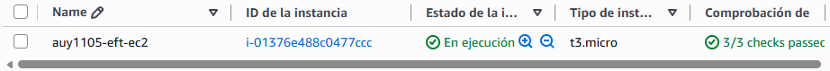

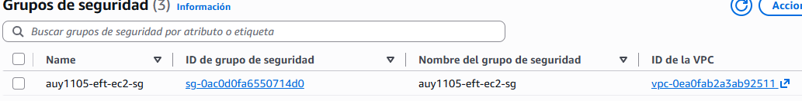

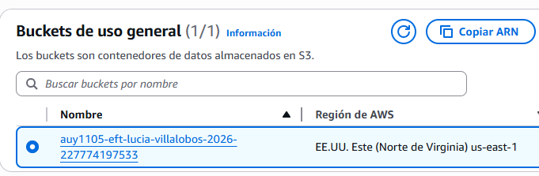

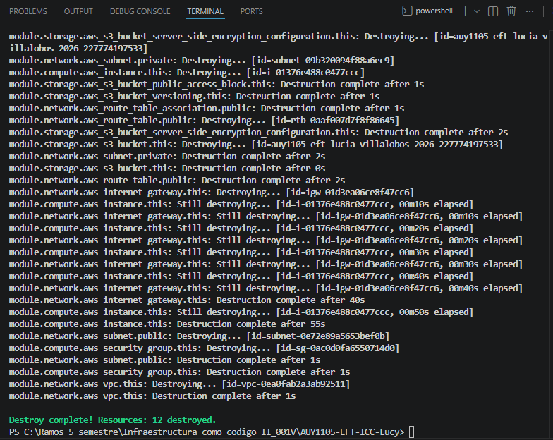

**Figura 51.** Recursos creados correctamente en Amazon Web Services.

---

# 📦 Publicación de módulos en HCP Terraform Registry

Como etapa final del proyecto, los módulos desarrollados fueron versionados mediante **Semantic Versioning** y publicados en **HCP Terraform Registry**, permitiendo su reutilización desde otros proyectos Terraform.

Este proceso garantiza una administración ordenada de versiones y facilita el consumo de los módulos como componentes independientes.

---

## Versionado del proyecto

Antes de la publicación se creó el tag **v1.0.0**, correspondiente a la primera versión estable de los módulos desarrollados.

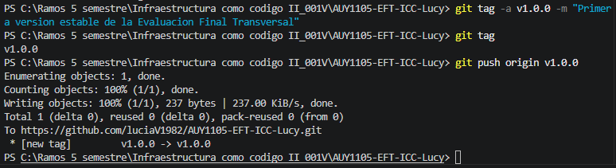

**Figura 53.** Creación del tag **v1.0.0**.

Posteriormente, el tag fue publicado en GitHub, quedando disponible como versión oficial del proyecto.

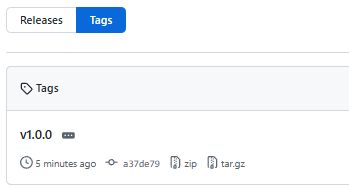

**Figura 54.** Publicación del tag en GitHub.

---

## Publicación en HCP Terraform Registry

Una vez versionados, los módulos fueron publicados en **HCP Terraform Registry**, permitiendo su utilización como módulos reutilizables desde cualquier proyecto Terraform compatible.

Como ejemplo, la siguiente imagen muestra la publicación del módulo **Network**.

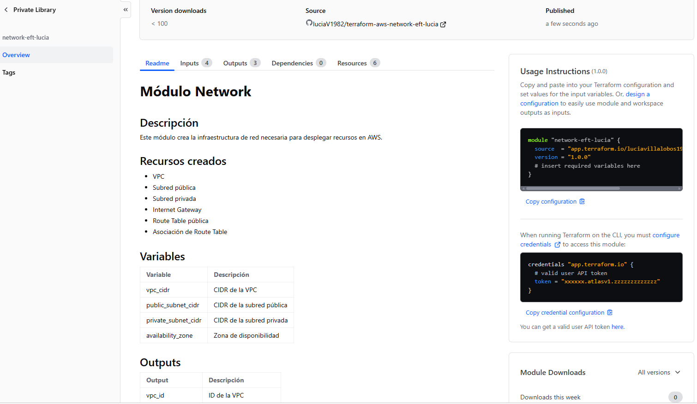

**Figura 55.** Publicación del módulo **Network** en HCP Terraform Registry.

Finalmente, los tres módulos desarrollados para esta evaluación quedaron disponibles en el Registry.

- Network
- Compute
- Storage

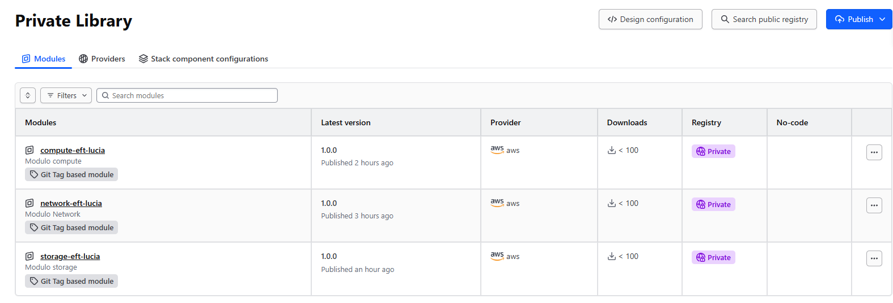

**Figura 56.** Módulos reutilizables publicados en HCP Terraform Registry.

La publicación de los módulos representa el cierre del ciclo de desarrollo, permitiendo que la infraestructura creada pueda ser reutilizada y mantenida mediante un esquema de versionado controlado.

---

# 🏁 Resultado final de la solución

La Evaluación Final Transversal permitió desarrollar una solución completa de Infraestructura como Código (IaC) utilizando Terraform, aplicando una arquitectura modular, buenas prácticas de desarrollo y automatización del proceso de validación.

Como resultado, se implementaron tres módulos reutilizables (**Network**, **Compute** y **Storage**), los cuales fueron versionados mediante **Semantic Versioning**, publicados en **HCP Terraform Registry** y posteriormente consumidos desde un proyecto principal para desplegar infraestructura sobre Amazon Web Services (AWS).

El siguiente cuadro resume los principales objetivos alcanzados durante el desarrollo del proyecto:

| Objetivo | Estado |
|----------|:------:|
| Desarrollo del módulo **Network** | ✅ |
| Desarrollo del módulo **Compute** | ✅ |
| Desarrollo del módulo **Storage** | ✅ |
| Configuración del proyecto principal | ✅ |
| Validación con Terraform Validate | ✅ |
| Validación mediante TFLint | ✅ |
| Validación de seguridad con Checkov | ✅ |
| Automatización mediante GitHub Actions | ✅ |
| Versionado mediante Git Tags | ✅ |
| Publicación en HCP Terraform Registry | ✅ |
| Despliegue exitoso en AWS | ✅ |
| Eliminación de la infraestructura mediante Terraform Destroy | ✅ |

Los resultados obtenidos evidencian el cumplimiento de los objetivos planteados para la evaluación, demostrando la correcta integración entre los módulos desarrollados, el proceso de automatización y el despliegue de infraestructura en la nube.

---

# ✅ Conclusiones

La Evaluación Final Transversal permitió aplicar de manera práctica los principales conceptos de Infraestructura como Código mediante Terraform, desarrollando una solución modular basada en componentes reutilizables para red, cómputo y almacenamiento.

Durante el desarrollo se implementaron buenas prácticas de organización del código, parametrización mediante variables, documentación técnica, control de versiones con Git, automatización de validaciones utilizando GitHub Actions y controles básicos de seguridad mediante TFLint y Checkov.

Asimismo, se aplicó versionado semántico y se publicaron los módulos en HCP Terraform Registry, validando su reutilización desde un proyecto principal encargado del despliegue de la infraestructura sobre Amazon Web Services.

Finalmente, la ejecución satisfactoria de las validaciones, el despliegue de los recursos en AWS y la posterior eliminación de la infraestructura mediante Terraform demostraron el correcto funcionamiento de la solución desarrollada y el cumplimiento de los objetivos establecidos para la Evaluación Final Transversal.